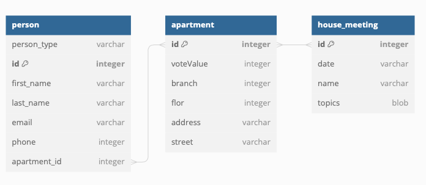

# House Management Application

In this app, you can save and load data about housekeeping, track person apartments, and determine if they attended the annual meeting.

The application is built in Java using Maven. You can build and run it from the terminal or IDE:

## Run in IDE
If you run the application (specifically the HouseDataApplication class) in IntelliJ or another IDE, the database is already created and connected, so you don't need to make any changes.
## Run in terminal
Navigate to the project folder.
Execute the following command to run the application pack:

    ./mvnw package

it will create target folder. In command line change folder to /target and run command:

    java -jar House-0.0.1-SNAPSHOT.jar

Please be cautious, as you need to establish a connection to the database in the application.properties file if you run the application from the terminal.

## Main requests which app supports

Address of API is http://localhost:8080/
I recommend using the Postman app for testing requests. You can download it from Postman's [official website](https://www.postman.com/downloads/).

### Apartments requests:

1. Get all apartments in json: (GET) http://localhost:8080/api/v1/apartments/

2. Add multiple apartments to DB: (POST)
`{
   "apartments": [
   {
   "id": 1,
   "voteValue": 74,
   "branchAntenna": "1",
   "flor": 0,
   "street": "Uliční",
   "address": 2434
   },
   {
   "id": 2,
   "voteValue": 46,
   "branchAntenna": "2",
   "flor": 0,
   "street": "Uliční",
   "address": 2434
   }
}`

3. Adding apartment to year meeting means persons have been there: (PUT) http://localhost:8080/api/v1/apartments/ and json body

`{
"idPerson": 6,
"idApartment": 3
}`

4. Get apartment by ID it is apartment number: (GET) http://localhost:8080/api/v1/apartments/apartment_id

### persons requests:
1. Get all persons: (GET) http://localhost:8080/api/v1/persons/

2. Get person by id: (GET) http://localhost:8080/api/v1/persons/person_id

3. Create new person: (POST) http://localhost:8080/api/v1/persons/ and json body where type of user could be -> User, Owner or SoldMovedOut

`{
"firstName": "Bobis",
"lastName": "Jarus",
"email": "bob@jar.com",
"phone": 123456789,
"typeOfUser": "User"
}`

4. Update person: (PUT) http://localhost:8080/api/v1/persons/ and json body where type of user could be -> User, Owner or SoldMovedOut

`{
"id": 24,
"firstName": "Bobo",
"lastName": "Jarusa",
"email": "bob@jara.com",
"phone": 123456789,
"typeOfUser": "SoldMovedOut"
}`

5. Delete person: (DEL) http://localhost:8080/api/v1/persons/person_id

### Meetings requests:
1. Create meeting: (POST) http://localhost:8080/api/v1/houseMeetings/ and json body

`{
"date":"1.1.2001",
"name":"Third Meeting.",
"topics":[
"1. First topic. ",
"2. Second topic. ",
"3. Third topic. "
]
}`

2. Get all meetings: (GET) http://localhost:8080/api/v1/houseMeetings/

3. Get meeting by id: (GET) http://localhost:8080/api/v1/houseMeetings/meeting_id

4. Add apartment to house meeting: http://localhost:8080/api/v1/houseMeetings/ and json body
`{
   "idHouseMeeting":4,
   "idApartment": 2
}`

these requests are just examples

## API with GUI
After start application you type address to web browser: http://localhost:8080/api/v2/
There you can use graphics user interface for handling data's.

## Structure:

Rest contain classes responsible for handling HTTP requests and responses.
Entity represent the data structure of application.
Dao/repository classes responsible for interacting with the database.
Service interact with the DAO layer to retrieve or update data, and may perform other tasks such as validation or data transformation. DTO is for returning shorter versions of apartments, persons and meetings it will be for sending all entities.

## DB scheme is:

## App scheme is:
